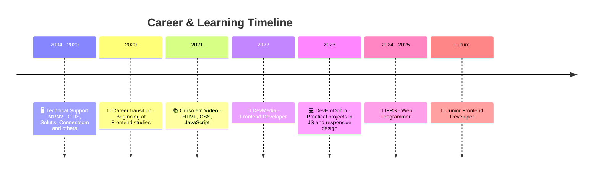
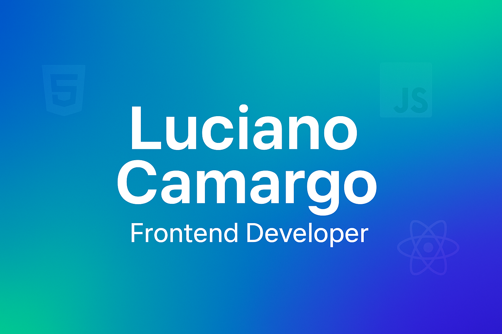

# 🚀 Frontend Portfolio - Luciano Camargo

[🇧🇷 Leia em Português](./README.md)

Welcome to my **Frontend Portfolio**!  
This repository was created to centralize my projects and experiments in **HTML5, CSS3, and JavaScript**, with a strong focus on **responsiveness, clean code practices, and UX/UI**.  
Updates and improvements will be added incrementally.

---

## 👨‍💻 About Me

I’m an IT professional with more than **20 years of experience in Technology**, working as **Technical Support Analyst (N1/N2)** in companies such as **CTIS, Solutis, and Connectcom**.  

During the **COVID-19 pandemic in 2019**, I started a career transition into **Frontend Web Development**, investing my time in courses, certifications, and practical projects.  
Today, I combine my solid technical background with continuous learning to create **modern, accessible, and user-friendly interfaces**.

---

## 🛤️ Career Timeline

  

---

## 🎓 Education & Training

- 🎥 **Curso em Vídeo – Prof. Gustavo Guanabara**  
- 📘 **DevMedia – Frontend Developer**  
- 💻 **DevEmDobro – Practical projects**  
- 🏫 **IFRS – Web Programmer (2024–2025)**  

---

## 🛠 Tech Stack & Tools

  
  
  
  
  
  
  

- **HTML5** – Web content structuring  
- **CSS3** – Styling, responsive design, and layouts  
- **JavaScript** – Interactivity and web dynamics  
- **React** – Component-based interfaces  
- **Git & GitHub** – Version control and collaboration  
- **UX/UI** – Creating functional, intuitive, and accessible interfaces  

---

## 🛣️ Learning Roadmap

📌 Upcoming topics and technologies I’m currently studying:  

- ⚛️ **Advanced React** – Hooks, Context API, React Router  
- 🟦 **TypeScript** – Static typing and scalable apps  
- ⚡ **Next.js** – SSR and static site generation  
- 🎨 **Tailwind CSS** – Modern styling and componentization  
- 🗄️ **APIs REST & GraphQL** – Data integration and consumption  
- ☁️ **Deploy & CI/CD** – Vercel, Netlify, GitHub Actions  
- 🐳 **Docker (basic)** – Containers for development  

---

## 💼 Projects

_(Links and images will be added as projects are completed)_  

| Project   | Description               | Technologies   | Demo |
|-----------|---------------------------|---------------|------|
| Portfolio | Personal responsive page  | HTML, CSS, JS | [Live Demo](https://karreiradev.lucamargo.github.io/meu-portfolio-dev-frontend/) |

---

## Estrutura do Projeto

meu-portfolio-dev-frontend/
│
├── index.html
├── style.css
├── README.md
├── README.en.md
│
├── src/
│   └── assets/
│       └── img/
│           ├── logo.webp
│           ├── euzinho1.webp
│           ├── html.webp
│           ├── css.webp
│           ├── js.webp
│           ├── Bootstrap1.webp
│           ├── Tailwindcss1.webp
│           ├── nodejs1.webp
│           ├── Reactjs2.webp
│           ├── Angular.webp
│           ├── VueJs1.webp
│           ├── ideia.webp
│           ├── TS_TypeScript.webp
│           ├── fontawesome.webp
│           ├── seo.webp
│           ├── auto.webp
│           └── banner1.png
│
└── fontawesome/   (❓ opcional se usar offline)
    └── css/
        └── all.min.css

## 📫 Contact

- **GitHub:** [@KarreiraDev-LuCamargo](https://github.com/KarreiraDev-LuCamargo)  
- **LinkedIn:** [Luciano Camargo](https://www.linkedin.com/in/dev-lucianocamargo)  
- **E-mail:** [karreiradev.lucamargo@gmail.com](mailto:karreiradev.lucamargo@gmail.com)  
- **WhatsApp:** [Click here to chat](https://wa.me/5521994629516)  

---

⭐️ Thanks for visiting my portfolio!  
More projects coming soon. 🚀  

> _"Clean code is code that you read and understand right away."_  
