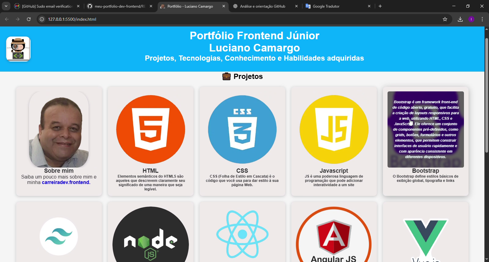

# 🚀 Frontend Portfolio - Luciano Camargo

Welcome to my **Frontend Portfolio**!  
This repository was created to centralize my projects and experiments in **HTML5, CSS3 and JavaScript**, focusing on **responsiveness, clean code practices and UX/UI**.  
Updates and improvements will be added incrementally.

[🇧🇷 Leia em Português](./README.md)

---

## 🎥 Portfolio Demo

### 🔹 GIF Preview

### 🔹 Screenshots

  
  

  
  
  

### 🔹 Full Video
👉 [Watch on YouTube](https://www.youtube.com/watch?v=aUmksP8TmUg) *(or replace with .mp4 link in the repo)*

---

## 🧑‍💻 About Me
I am an IT professional with over **20 years of experience in Information Technology**, working as Support Technician (N1 and N2) in companies such as **CTIS, Solutis and Connectcom**.

In **2019**, impacted by the pandemic, I started my transition to **Frontend Web Development**, investing in courses, training, and practical projects.  
Today, I apply my strong technical foundation to continuous learning, creating modern, accessible, and functional interfaces.

---

## 🌱 My Journey

\`\`\`timeline
title Timeline - Career & Learning
2004 - 2020 : 💻 IT Support Technician N1 and N2 – CTIS, Solutis, Connectcom and others
2020 : 🔄 Career transition – Starting Web Development studies
2021 : 🎓 Curso em Vídeo – HTML, CSS, JavaScript
2022 : 📘 DevMedia – Frontend Developer
2023 : 🖥️ DevEmDobro – Practical projects in JS and responsiveness
2024 - 2025 : 🏫 IFRS – Web Programming
Future : 🚀 Junior Frontend Developer
\`\`\`

---

## 🎓 Education & Courses
- 🎥 **Curso em Vídeo – Prof. Gustavo Guanabara**
- 📘 **DevMedia – Frontend Developer**
- 🖥️ **DevEmDobro – Practical Projects**
- 🏫 **IFRS – Web Programming (2024–2025)**

---

## 🛠️ Technologies & Tools
- **HTML5** – Structuring content for web pages.  
- **CSS3** – Styling, responsiveness, and modern layouts.  
- **JavaScript** – Interactivity and dynamics in web applications.  
- **React** – Componentization and scalable interfaces.  
- **Git & GitHub** – Version control and project collaboration.  
- **UX/UI** – Designing functional, intuitive, and accessible interfaces.  

---

## 📍 Learning Roadmap
Next technologies and topics under study:
- ⚛️ **Advanced React** – Hooks, Context API, React Router
- 🟦 **TypeScript** – Static typing and scalability
- ▲ **Next.js** – SSR and static site generation
- 🎨 **Tailwind CSS** – Modern styling and componentization
- 🔌 **REST APIs & GraphQL** – Data integration
- 🚀 **Deploy & CI/CD** – Vercel, Netlify, GitHub Actions
- 🐳 **Docker (basic)** – Containers for development

---

## 📂 Projects

| Project     | Description                | Technologies | Link        |
|-------------|----------------------------|--------------|-------------|
| **Portfolio** | Responsive personal page | HTML, CSS, JS | [View online](https://karreiradev-lucamargo.github.io/meu-portfolio-dev-frontend/) |

---

## 📁 Project Structure
\`\`\`
meu-portfolio-dev-frontend/
│── index.html
│── style.css
│── README.md
│── README.en.md
│
└── src/
    └── assets/
        ├── img/
        │   ├── logo.webp
        │   ├── euzinho1.webp
        │   ├── html.webp
        │   ├── css.webp
        │   ├── js.webp
        │   ├── Bootstrap1.webp
        │   ├── Tailwindcss1.webp
        │   ├── nodejs1.webp
        │   ├── Reactjs2.webp
        │   ├── Angular.webp
        │   ├── VueJs1.webp
        │   ├── ideia.webp
        │   ├── TS_TypeScript.webp
        │   ├── fontawesome.webp
        │   ├── seo.webp
        │   ├── auto.webp
        │   └── banner1.png
        │
        ├── demo/ (Portfolio GIFs and Screenshots)
        │   ├── portfolio_demo.gif
        │   ├── screenshot_1.png
        │   ├── screenshot_2.png
        │   ├── screenshot_3.png
        │   ├── screenshot_4.png
        │   └── screenshot_5.png
        │
        └── css/
            └── all.min.css
\`\`\`

---

## 📌 Note
💡 The \`fontawesome/\` folder is optional.  
By default, Font Awesome is loaded via **CDN**, but if needed for offline projects, the folder can be activated.

---

## 📫 Contact
- **GitHub:** [@KarreiraDev-LuCamargo](https://github.com/KarreiraDev-LuCamargo)  
- **LinkedIn:** [Luciano Camargo](https://www.linkedin.com/in/dev-lucianocamargo)  
- **E-mail:** karreiradev.lucamargo@gmail.com  
- **WhatsApp:** [Click here to chat](https://wa.me/5561999999999)  

---

⭐ Thank you for visiting my portfolio!  
More projects will be available soon 🚀  

_"Clean code is code that you can read and understand right away."_

