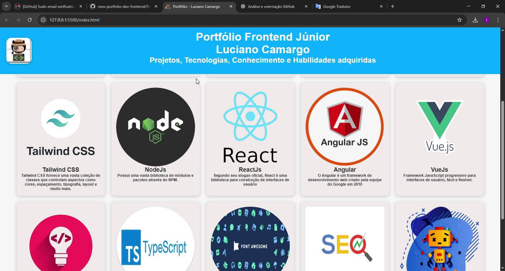
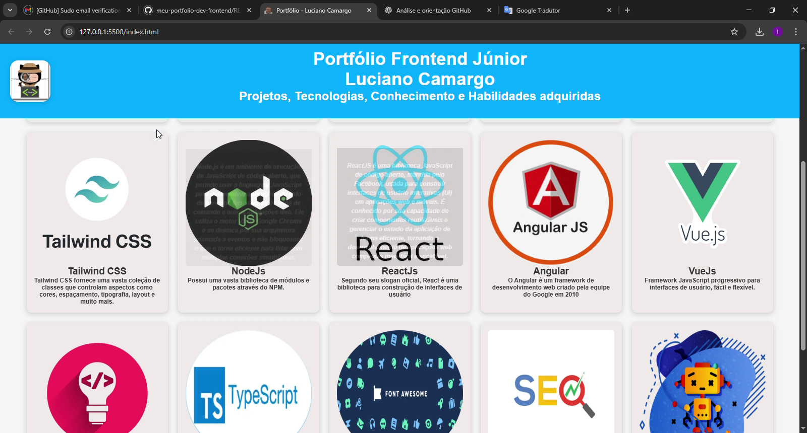
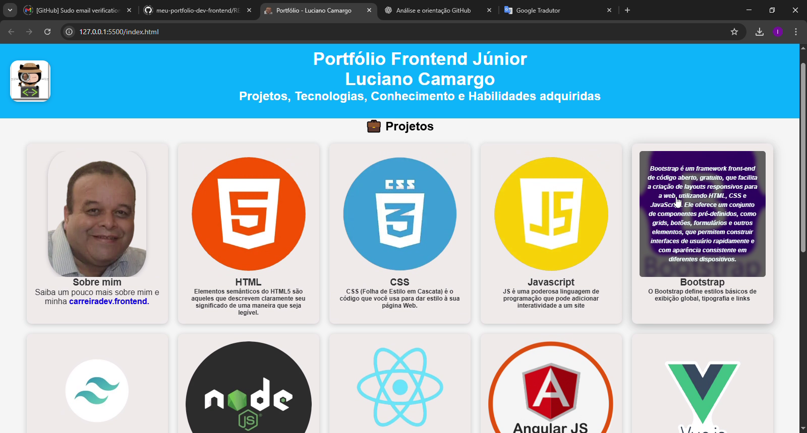
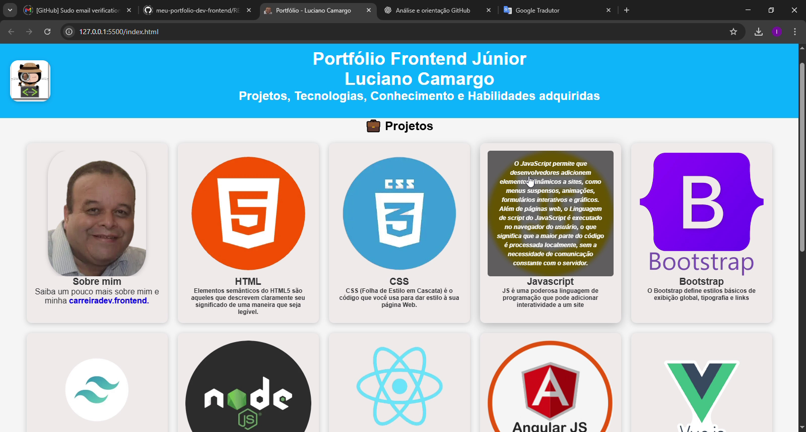

# 🚀 Portfólio Frontend - Luciano Camargo

Bem-vindo ao meu **Portfólio Frontend**!  
Este repositório foi criado para centralizar meus projetos e experimentos em **HTML5, CSS3 e JavaScript**, priorizando **responsividade, boas práticas de código e UX/UI**.  
Atualizações e melhorias serão adicionadas de forma incremental.

[🇬🇧 Read this in English](./README.en.md)

---

## 🎥 Demonstração do Portfólio

### 🔹 Prévia em GIF

### 🔹 Screenshots

  
  

  
  
  

### 🔹 Vídeo completo
👉 [Assista no YouTube](https://www.youtube.com/watch?v=aUmksP8TmUg) *(ou substitua pelo link do vídeo .mp4 no repo)*

---

## 🧑‍💻 Sobre Mim
Sou profissional com mais de **20 anos de experiência em Tecnologia da Informação**, atuando como Técnico de Suporte N1 e N2 em empresas como **CTIS, Solutis e Connectcom**.

Com os impactos da **pandemia de 2019**, iniciei minha transição para o **Desenvolvimento Web Frontend**, investindo em cursos, formações e projetos práticos.  
Hoje, aplico minha base técnica sólida no aprendizado contínuo para criar interfaces modernas, acessíveis e funcionais.

---

## 🌱 Minha Jornada

\`\`\`timeline
title Linha do Tempo - Carreira & Aprendizado
2004 - 2020 : 💻 Suporte Técnico N1 e N2 – CTIS, Solutis, Connectcom e outras
2020 : 🔄 Transição de carreira – Início dos estudos em Desenvolvimento Web
2021 : 🎓 Curso em Vídeo – HTML, CSS, JavaScript
2022 : 📘 DevMedia – Frontend Developer
2023 : 🖥️ DevEmDobro – Projetos práticos em JS e responsividade
2024 - 2025 : 🏫 IFRS – Programador Web
Futuro : 🚀 Desenvolvedor Frontend Júnior
\`\`\`

---

## 🎓 Formações e Cursos
- 🎥 **Curso em Vídeo – Prof. Gustavo Guanabara**
- 📘 **DevMedia – Frontend Developer**
- 🖥️ **DevEmDobro – Projetos práticos**
- 🏫 **IFRS – Programador Web (2024–2025)**

---

## 🛠️ Tecnologias e Ferramentas
- **HTML5** – Estruturação de conteúdo para páginas web.  
- **CSS3** – Estilização, responsividade e layouts modernos.  
- **JavaScript** – Interatividade e dinamismo em aplicações web.  
- **React** – Componentização e interfaces escaláveis.  
- **Git & GitHub** – Versionamento e colaboração em projetos.  
- **UX/UI** – Criação de interfaces funcionais, intuitivas e acessíveis.  

---

## 📍 Roadmap de Aprendizado
Próximas tecnologias e tópicos em estudo:
- ⚛️ **React Avançado** – Hooks, Context API, React Router
- 🟦 **TypeScript** – Tipagem estática e escalabilidade
- ▲ **Next.js** – SSR e geração estática de sites
- 🎨 **Tailwind CSS** – Estilização moderna e componentização
- 🔌 **APIs REST & GraphQL** – Integração de dados
- 🚀 **Deploy & CI/CD** – Vercel, Netlify, GitHub Actions
- 🐳 **Docker (básico)** – Containers para desenvolvimento

---

## 📂 Projetos

| Projeto     | Descrição                   | Tecnologias  | Link        |
|-------------|-----------------------------|--------------|-------------|
| **Portfólio** | Página pessoal responsiva | HTML, CSS, JS | [Ver online](https://karreiradev-lucamargo.github.io/meu-portfolio-dev-frontend/) |

---

## 📁 Estrutura do Projeto
\`\`\`
meu-portfolio-dev-frontend/
│── index.html
│── style.css
│── README.md
│── README.en.md
│
└── src/
    └── assets/
        ├── img/
        │   ├── logo.webp
        │   ├── euzinho1.webp
        │   ├── html.webp
        │   ├── css.webp
        │   ├── js.webp
        │   ├── Bootstrap1.webp
        │   ├── Tailwindcss1.webp
        │   ├── nodejs1.webp
        │   ├── Reactjs2.webp
        │   ├── Angular.webp
        │   ├── VueJs1.webp
        │   ├── ideia.webp
        │   ├── TS_TypeScript.webp
        │   ├── fontawesome.webp
        │   ├── seo.webp
        │   ├── auto.webp
        │   └── banner1.png
        │
        ├── demo/ (GIFs e Screenshots do portfólio)
        │   ├── portfolio_demo.gif
        │   ├── screenshot_1.png
        │   ├── screenshot_2.png
        │   ├── screenshot_3.png
        │   ├── screenshot_4.png
        │   └── screenshot_5.png
        │
        └── css/
            └── all.min.css
\`\`\`

---

## 📌 Observação
💡 A pasta \`fontawesome/\` é opcional.  
Para efeito global, o uso padrão é apenas o **CDN do Font Awesome**, mas caso precise usar offline, a pasta pode ser ativada.

---

## 📫 Contato
- **GitHub:** [@KarreiraDev-LuCamargo](https://github.com/KarreiraDev-LuCamargo)  
- **LinkedIn:** [Luciano Camargo](https://www.linkedin.com/in/dev-lucianocamargo)  
- **E-mail:** karreiradev.lucamargo@gmail.com  
- **WhatsApp:** [Clique aqui para conversar](https://wa.me/5561999999999)  

---

⭐ Obrigado por visitar meu portfólio!  
Mais projetos estarão disponíveis em breve 🚀  

_"Código limpo é aquele que você lê e entende de primeira."_

