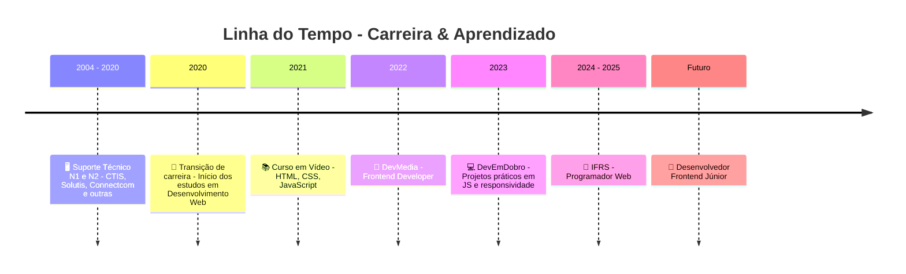

# 🚀 Portfólio Frontend - Luciano Camargo

[🇬🇧 Read this in English](./README.en.md)

Bem-vindo ao meu **Portfólio Frontend**!  
Este repositório foi criado para centralizar meus projetos e experimentos em **HTML5, CSS3 e JavaScript**, priorizando **responsividade, boas práticas de código e UX/UI**.  
Atualizações e melhorias serão adicionadas de forma incremental.

---

## 👨‍💻 Sobre Mim

Sou profissional com mais de **20 anos de experiência em Tecnologia da Informação**, atuando como Técnico de Suporte N1 e N2 em empresas como **CTIS, Solutis e Connectcom**.  

Com os impactos da **pandemia de 2019**, iniciei minha transição para o **Desenvolvimento Web Frontend**, investindo em cursos, formações e projetos práticos.  
Hoje, aplico minha base técnica sólida no aprendizado contínuo para criar interfaces modernas, acessíveis e funcionais.

---

## 🛤️ Minha Jornada

---

## 🎓 Formações e Cursos

- 🎥 **Curso em Vídeo – Prof. Gustavo Guanabara**  
- 📘 **DevMedia – Frontend Developer**  
- 💻 **DevEmDobro – Projetos práticos**  
- 🏫 **IFRS – Programador Web (2024–2025)**  

---

  

## 🛠 Tecnologias e Ferramentas

  
  
  
  
  
  
  

- **HTML5** – Estruturação de conteúdo para páginas web.  
- **CSS3** – Estilização, responsividade e layouts modernos.  
- **JavaScript** – Interatividade e dinamismo em aplicações web.  
- **React** – Componentização e interfaces escaláveis.  
- **Git & GitHub** – Versionamento e colaboração em projetos.  
- **UX/UI** – Criação de interfaces funcionais, intuitivas e acessíveis.  

---

## 🛣️ Roadmap de Aprendizado

📌 Próximas tecnologias e tópicos em estudo:  

- ⚛️ **React Avançado** – Hooks, Context API, React Router  
- 🟦 **TypeScript** – Tipagem estática e escalabilidade  
- ⚡ **Next.js** – SSR e geração estática de sites  
- 🎨 **Tailwind CSS** – Estilização moderna e componentização  
- 🗄️ **APIs REST & GraphQL** – Integração de dados  
- ☁️ **Deploy & CI/CD** – Vercel, Netlify, GitHub Actions  
- 🐳 **Docker (básico)** – Containers para desenvolvimento  

---

## 💼 Projetos

_(Os links e imagens serão adicionados à medida que os projetos forem concluídos)_  

| Projeto   | Descrição                  | Tecnologias   | Demo |
|-----------|----------------------------|---------------|------|
| Portfólio | Página pessoal responsiva  | HTML, CSS, JS | [Ver online](https://lucamargo220863.github.io/meu-portfolio-dev-frontend/) |

---

## 📫 Contato

- **GitHub:** [@KarreiraDev-LuCamargo](https://github.com/KarreiraDev-LuCamargo)  
- **LinkedIn:** [Luciano Camargo](https://www.linkedin.com/in/dev-lucianocamargo)  
- **E-mail:** [karreiradev.lucamargo@gmail.com](mailto:karreiradev.lucamargo@gmail.com)  
- **WhatsApp:** [Clique aqui para conversar](https://wa.me/5521994629516)  

---

⭐️ Obrigado por visitar meu portfólio!  
Mais projetos estarão disponíveis em breve. 🚀  

> _"Código limpo é aquele que você lê e entende de primeira."_  
